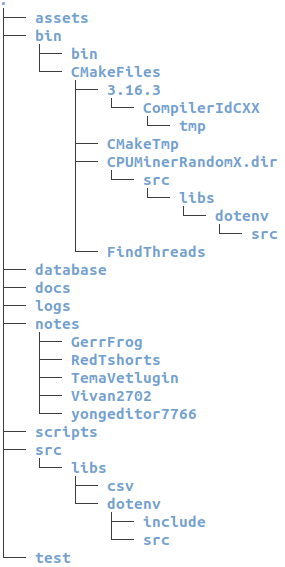

# CPUMinerBase
Skelet for any CPU-miner projects

## Update repository by template
```bash
git remote add template [URL of the template repo]

git fetch --all

git merge template/[branch to merge] --allow-unrelated-histories
```

## Create branch from another branch
```bash
git checkout -b myFeature dev

git commit -am "Your message"

git checkout dev

git merge --no-ff myFeature

git push origin dev

git push origin myFeature
```

## Project Tree
```bash
$ sudo apt install tree
$ tree -aC
```

<center></img></center>

- **assets:** Files for README.md file.
- **bin:** Directory for building and making project.
- **database:** Stores working database.
- **docs:** Documentation for project
- **logs:** Logs when miner is working
- **notes:** Contributors notes while developing project
- **scripts:** Basic Python scripts
- **src:** Source files
    - **libs:** External libraries for project

## **Install**
Install dependencies
```bash
$ sudo bash install.sh
```

Make executable file
```bash
$ mkdir bin/ && cd bin/
$ cmake .. && make -j4
```

Execute file
```bash
$ ./CPUMinerRandomX
```

## Contributors:
- [Рехлин Олег, 360-4](https://github.com/yongeditor7766)
- [Ветлугин Артем, 360-4](https://github.com/TemaVetlugin)
- [Висков Иван, 360-4](https://github.com/Vivan2702)
- [Сапаргали Ерсултан, 360-4](https://github.com/Reedhook)
- [Ибрагимов Даниил, 360-4 (team lead)](https://github.com/GerrFrog)


